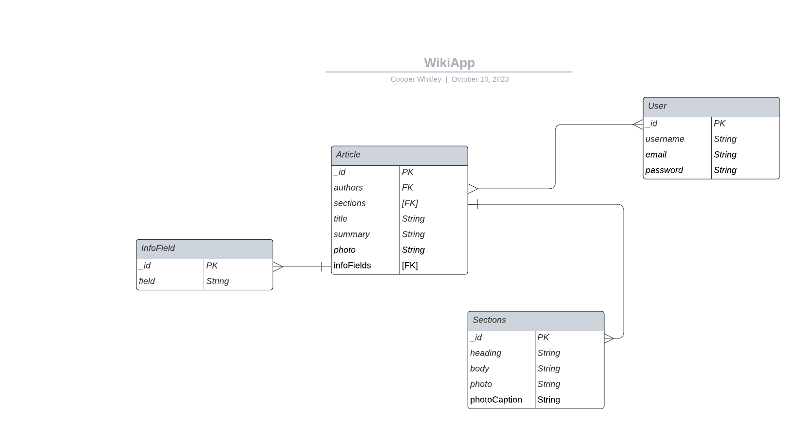

# Open Wiki

An open source standard for custom wikis. Fans can set up a wiki for something they're excited about by simply cloning and deploying this repo, as well as the <a href="https://github.com/cooperwhitley/OpenWikiAPI">associated API</a>. No longer will using ad-riddled low performance proprietary wiki web apps or designing your own be the requirement to build a knowledge base for an online community.

## Screenshots

## Technologies Used

- MongoDB
- Express.js
- React.js
- Node.js
- Bootstrap

## Planning Docs

### User Stories

#### As a user I want to...

- View articles without signing in
- Sign up for an account
- Log in/out
- Write an article, which includes...
  - A title
  - A summary paragraph
  - Image upload
  - A quick information box
  - Sub sections
  - References
  - Links to other articles
- Edit any article

### Wireframes

### ERD

## Next Steps

- Unified editor for all subdocs in an article
- Inline links
- Version/edit history
- Article categories
- Article discussion forums
- General forums
- Wiki admin features, such as...
  - Restricting edit access
  - Wiki branding options
  - Content moderation tools